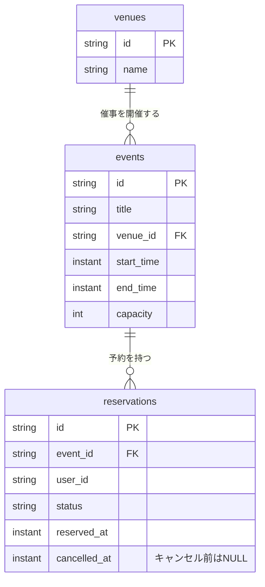

# ERD

[ドメインモデル](./domain-model.md) の永続化を表す論理モデル案です。
催事の `events`、予約の `reservations`、会場マスタの `venues` を持ちます。
`events` と `reservations` は別集約です。FKと一対多の関係は、集約の包含関係を意味しません。
DBはPostgreSQL、ORMはPrisma、Migrationの適用はPrisma Migrateを使います。
DB構造の正典はMigrationのSQLです。現在は [0_init/migration.sql](../prisma/migrations/0_init/migration.sql) の1つにまとめます。
[Prisma Schema](../prisma/schema.prisma) はPrisma用のマッピングとしてSQLと同期させます。

図の型は論理型です。PostgreSQLでの物理型は次のとおりです。

| 対象 | 物理型 |
| --- | --- |
| 催事・会場・予約のIDとそれらのFK | `VARCHAR(36)`（UUIDの文字列表現を想定） |
| 利用者のID | `VARCHAR`（認証基盤の識別子の形式が未決定のため長さは未指定） |
| タイトル、会場名 | `TEXT` |
| 開始・終了・予約・キャンセル日時 | `TIMESTAMPTZ(3)`（ミリ秒精度の時点） |
| 定員 | `INTEGER` |
| 予約状態 | `reservation_status` ENUM（`reserved` / `cancelled`） |

`events.venue_id` は必須で、催事には必ず1つの会場を割り当てます。会場は催事が0件でも存在できます。
`user_id` は認証されたユーザーの識別子です。認証基盤のテーブルはこのERDの対象外であり、認証の保存方式が決まるまではFKを定義しません。

## 制約と検索

| 対象 | 制約・検索の方針 |
| --- | --- |
| `events` | `start_time < end_time`、`capacity > 0` |
| `events.venue_id` | NOT NULLと、存在する会場を参照するFK |
| `reservations.event_id` | 存在する催事を参照するFK |
| `reservations.status` | `reserved` / `cancelled` の2値 |
| キャンセル日時 | `reserved` なら `cancelled_at IS NULL`、`cancelled` なら `cancelled_at IS NOT NULL` |
| 予約・キャンセル日時の順序 | `cancelled_at` がある場合は `cancelled_at >= reserved_at` |
| 有効な予約の重複 | `status = 'reserved'` の行だけで `(event_id, user_id)` を一意にする |
| 件数と本人の予約の取得 | `event_id`・`status` に基づく集計と、`event_id`・`user_id`・`status` による検索を索引で支える |

同じ会場を複数の催事が参照できます。会場の時間帯重複を禁止するルールは今回のモデルには含めません。
会場名は `venues` に保存し、催事の一覧・詳細で取得して表示します。

キャンセル後に新しい予約を作るため、全行を対象とする `(event_id, user_id)` のUNIQUE制約は使えません。
有効な予約だけの一意制約は、`WHERE status = 'reserved'` を条件とする部分一意索引で実装します。
CHECK制約と部分一意索引は初回MigrationのSQLで管理します。FKには `ON DELETE RESTRICT` を設定し、参照中の会場・催事を削除して関連を壊さないようにします。
SQLの識別子は小文字のsnake_caseとし、予約語など引用が必要な場合を除いてダブルクォートを付けません。
FKは `CREATE TABLE` の中に定義し、索引は対応するテーブルを作った直後にまとめます。

リリース前の学習用として、初回Migrationを直接修正する運用にします。変更時にはPrisma Schemaも合わせて修正します。
リリース後は適用済みのSQLを固定し、変更用SQLを新しいMigrationディレクトリへ追加します。手順は [DB Migrationの運用](./database-migrations.md) を参照してください。
DBテストでは毎回新しいスキーマへMigrationを適用するため、以前の適用履歴に影響されずに検証できます。
Prismaが表現できる構造については、SQL適用後のDBとPrisma Schemaに差分がないこともテスト準備時に確認します。

有効な予約数と残席数は予約から計算し、`events` に重複して保存しません。
`EventAvailability` 用のテーブルは設けません。`EventAvailabilityRepository` は催事・会場・有効予約数をまとめて取得し、読み取り用Entityを復元します。
予約時に全予約を復元せず、有効な予約件数と対象ユーザーの有効な予約の存在を取得します。キャンセル時は対象予約1件を取得します。
定員超過は単一行のCHECK制約で保証できないため、催事行のロックとDomainの判定を組み合わせます。
詳細は [集約の更新手順](./domain-model.md#applicationと永続化の境界) を参照してください。
