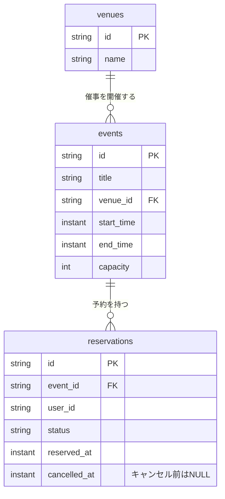

# ERD

[ドメインモデル](./domain-model.md) の永続化を表す論理モデル案です。
催事の `events`、予約の `reservations`、会場マスタの `venues` を持ちます。
`events` と `reservations` は別集約です。FKと一対多の関係は、集約の包含関係を意味しません。
DBの製品・物理型・Migration方式は未決定です。

`instant` は時点を表す論理型です。物理型はDB選定時に決定します。
`events.venue_id` は必須で、催事には必ず1つの会場を割り当てます。会場は催事が0件でも存在できます。
`user_id` は認証されたユーザーの識別子です。認証基盤のテーブルはこのERDの対象外であり、認証の保存方式が決まるまではFKを定義しません。

## 制約と検索

| 対象 | 制約・検索の方針 |
| --- | --- |
| `events` | `start_time < end_time`、`capacity > 0` |
| `events.venue_id` | NOT NULLと、存在する会場を参照するFK |
| `reservations.event_id` | 存在する催事を参照するFK |
| `reservations.status` | `reserved` / `cancelled` の2値 |
| キャンセル日時 | `reserved` なら `cancelled_at IS NULL`、`cancelled` なら `cancelled_at IS NOT NULL` |
| 有効な予約の重複 | `status = 'reserved'` の行だけで `(event_id, user_id)` を一意にする |
| 件数と本人の予約の取得 | `event_id`・`status` に基づく集計と、`event_id`・`user_id`・`status` による検索を索引で支える |

同じ会場を複数の催事が参照できます。会場の時間帯重複を禁止するルールは今回のモデルには含めません。
会場名は `venues` に保存し、催事の一覧・詳細で取得して表示します。

キャンセル後に新しい予約を作るため、全行を対象とする `(event_id, user_id)` のUNIQUE制約は使えません。
有効な予約だけの一意制約は、対応するDBなら部分一意索引で実装します。具体的なDDLはDB選定時に決定します。

有効な予約数と残席数は予約から計算し、`events` に重複して保存しません。
`EventAvailability` 用のテーブルは設けません。`EventAvailabilityRepository` は催事・会場・有効予約数をまとめて取得し、読み取り用Entityを復元します。
予約時に全予約を復元せず、有効な予約件数と対象ユーザーの有効な予約の存在を取得します。キャンセル時は対象予約1件を取得します。
定員超過は単一行のCHECK制約で保証できないため、催事行のロックとDomainの判定を組み合わせます。
詳細は [集約の更新手順](./domain-model.md#applicationと永続化の境界) を参照してください。
