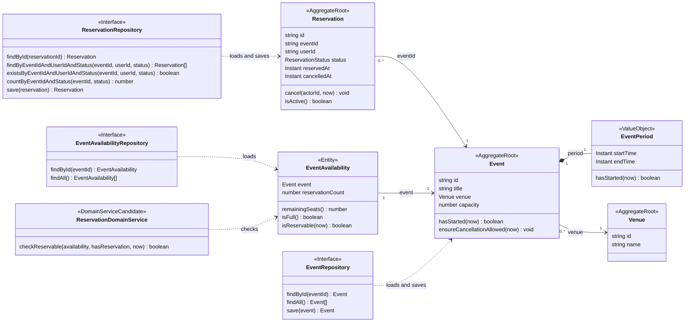
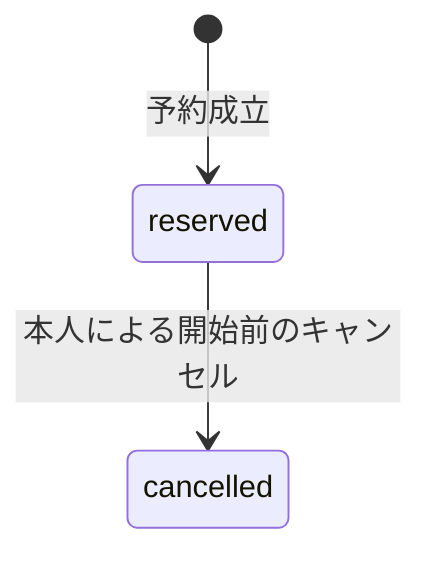

# ドメインモデル

催事の予約とキャンセルを扱う初期モデル案です。実装を進めながら更新します。
業務用語の意味とコード名は [ユビキタス言語](./ubiquitous-language.md) にまとめます。
1つの予約で確保する席は1席とし、催事と会場は初期データで用意します。
1つの催事に会場は必ず1つあり、1つの会場で複数の催事を開催できます。

## 用語と責務

| 概念 | モデル | 責務 |
| --- | --- | --- |
| 催事 | `Event` | 開催情報と会場への参照を持ち、催事自身の属性を管理する |
| 催事の空き状況 | `EventAvailability` | 催事と有効予約数を持ち、残席・満席・予約受付可否を判断する読み取り用Entity |
| 会場 | `Venue` | 催事が参照する会場の識別子と名称を持つ |
| 予約 | `Reservation` | 予約者と予約状態を持ち、本人によるキャンセルを表現する |
| 開催期間 | `EventPeriod` | 開始が終了より前であることを保証し、開始済みかを判定する |
| 予約可否の判断 | `ReservationDomainService`（候補） | 催事の空き状況と本人の予約有無から予約可否を返す。切り出すかは実装を見て判断する |
| 識別子 | `string` | 催事・会場・予約・利用者を識別する |

タイトル・会場名・定員はprimitiveで扱います。定員は正の整数とし、`Event` の生成・復元時に検証します。
IDは `string` とし、ID用のValue ObjectやBranded Typeは導入しません。催事・会場・予約のIDはUUID文字列を想定します。利用者IDの形式は認証基盤の選定時に決定します。
開催期間には2つの日時にまたがる不変条件があるため、Value Objectを使います。

## 集約の境界

`Event`・`Reservation`・`Venue` をそれぞれ独立した集約ルートとして扱います。
予約は `eventId: string` で催事を参照し、自身の予約者・状態・予約日時・キャンセル日時を管理します。
催事には予約コレクションを持たせません。予約・キャンセルでは、対象の予約1件を作成・更新します。
予約の状態はEntityのメソッドで変更し、外部から直接書き換えさせません。
会場は独立したマスタとして扱い、`Event` は `Venue` を参照します。`venueId` は参照先のIDから取得します。
会場の名称は `Venue` に置きます。会場の管理操作は初期版に含めず、定員は催事ごとの値として扱います。
`EventRepository` は会場をJOINして `Event` を復元します。`Event` の保存では催事の属性と `venue_id` を書き込み、会場の属性は `VenueRepository` が保存します。
`Venue` は自身だけで構成される集約のルートであり、同時にEntityです。
集約の境界は、管理画面の有無ではなく、どのモデルを一体として取得・変更し、整合性を守るかで決めます。
将来の会場管理でも、会場の追加・名称変更は `Venue` を取得・作成して保存する形を基本にします。会場名の変更のために、その会場を参照する全催事を読み込む必要はありません。

`EventAvailability` は `event: Event` と `reservationCount: number` を持ち、催事のIDで識別します。予約数は0以上の整数として扱います。
催事の属性と予約数を使って業務判断する読み取り用モデルであり、独立したテーブルや保存操作は持ちません。
予約数を `Event` のフィールドに追加せず、催事の保存・更新と空き状況の取得を分けます。



RepositoryはSpring Data JPAの命名・戻り値の方針に準じます。操作は非同期とし、IDによる取得で対象が存在しない場合は `null`、複数件の検索で対象が存在しない場合は空配列を返します。
`save` は保存後のDomain Entityを返します。呼び出し元は戻り値を使い、入力と同じインスタンスであることを前提にしません。
図では `Promise` と取得結果のnull許容を省略しています。TypeScriptのシグネチャ案は次のとおりです。

```ts
interface EventRepository {
  findById(id: string): Promise<Event | null>;
  findAll(): Promise<Event[]>;
  save(event: Event): Promise<Event>;
}

interface EventAvailabilityRepository {
  findById(id: string): Promise<EventAvailability | null>;
  findAll(): Promise<EventAvailability[]>;
}

interface ReservationRepository {
  findById(id: string): Promise<Reservation | null>;
  findByEventIdAndUserIdAndStatus(
    eventId: string,
    userId: string,
    status: ReservationStatus,
  ): Promise<Reservation[]>;
  existsByEventIdAndUserIdAndStatus(
    eventId: string,
    userId: string,
    status: ReservationStatus,
  ): Promise<boolean>;
  countByEventIdAndStatus(
    eventId: string,
    status: ReservationStatus,
  ): Promise<number>;
  save(reservation: Reservation): Promise<Reservation>;
}
```

一覧のページング引数や戻り値の詳細は、実装時に決定します。
`EventAvailabilityRepository` のInfrastructure実装は、催事・会場・有効予約数をJOIN・集計してDomain Objectへ復元します。
一覧でも催事ごとに件数取得を繰り返さず、まとめて取得します。取得した集計値はその時点の値で、予約やキャンセル後に再取得すると更新されます。

予約可否の判定では `status = 'reserved'` の件数と存在を取得します。本人の予約情報の表示には同じ条件の検索を使います。
キャンセル済みは再予約のたびに複数件になり得るため、statusを指定する検索の戻り値は配列にします。
参照元：[CrudRepository](https://docs.spring.io/spring-data/commons/docs/current/api/org/springframework/data/repository/CrudRepository.html)、[クエリメソッドの命名](https://docs.spring.io/spring-data/jpa/reference/repositories/query-methods-details.html)。
`cancelledAt` は予約済みの間は `null` です。`Instant` は時点を表す概念名で、独自クラスの導入を意味しません。

催事と予約の関連やFKがあることだけでは、同じ集約と判断しません。
予約には予約成立からキャンセルまでの状態遷移があり、予約者と予約IDを使って個別に操作します。
一方、定員と重複予約は複数の予約にまたがるルールです。別集約に分けても、この整合性は同期的に保証します。
予約時に全予約をロードする代わりに、有効な予約の件数と、対象ユーザーの有効な予約が存在するかを取得します。

## 振る舞いと不変条件

| 振る舞い | 判断するモデル | 守るルール |
| --- | --- | --- |
| 予約する | `EventAvailability` | 開始前であり、有効な予約数が定員未満である。開始済みかは `Event` に確認する |
| 予約する | `ReservationDomainService` またはApplication（配置は未決定） | 同じユーザーの有効な予約が存在しない。空き状況の条件は `EventAvailability` に確認する |
| キャンセルする | `Event` | 対象予約の催事が開始前である |
| キャンセルする | `Reservation` | 操作者が予約者本人であり、予約状態が `reserved` である |
| 開催期間を作る | `EventPeriod` | `startTime < endTime` である |

開始時刻ちょうどから予約・キャンセル不可とします。判定は `now >= startTime` です。
現在時刻はApplication側で取得し、Domainのメソッドに渡します。
保存時の日時はこの値を使い、Repositoryが別の現在時刻で上書きしないようにします。
日時は `Date` で保持し、同じ時点として比較します。Node.jsは `TZ=Asia/Tokyo` で動作させ、入力・表示は東京時刻を使います。DBは `TIMESTAMPTZ(3)` で時点を保持し、入力時のオフセットは保存しません。ブラウザでの表示にも `Asia/Tokyo` を明示します。

Domain Serviceを切り出す場合は、取得した空き状況と本人の予約有無を `ReservationDomainService.checkReservable` に渡し、booleanで可否を受け取る案です。
取得とユースケースの進行はApplicationが担当し、空き状況の判断は `EventAvailability.isReservable`、予約状態の変更は `Reservation` に持たせます。
複数の判定を組み合わせる処理をDomain Serviceにまとめるか、Applicationにそのまま置くかは、実装時にコードの見通しと判定の再利用を見て決めます。
booleanでは失敗理由が返らないため、理由ごとのエラー表示が必要になった場合は戻り値の設計を再検討します。Applicationで同じ条件を再判定して理由を復元する形は避けます。
キャンセル時は、対象予約の `eventId` で取得した催事の `ensureCancellationAllowed` と、予約自身の `cancel` を呼び出します。
催事は開始時刻の条件、予約は本人と状態の条件を保証します。

## 予約の状態



キャンセル済みの予約も記録として残します。有効な予約数と重複予約の判定対象は `reserved` のみです。
キャンセル後の再予約は、新しい予約IDを持つ別の予約として作成します。
`cancelled` から `reserved` に戻す操作はありません。再度のキャンセルはエラーにします。

## Applicationと永続化の境界

凝集度の高い `EventApplicationService` に参照・予約・キャンセルの操作をまとめる案です。
`EventRepository` は催事を、`ReservationRepository` は予約を取得します。
`EventAvailabilityRepository` は催事の空き状況を取得する専用Repositoryとし、保存操作を設けません。
予約の保存は `ReservationRepository` が担当します。初期版の予約操作では催事自体は更新しません。
取得したDomain Objectや集計値を使って予約可否を判断します。`ReservationDomainService` の導入は実装を見て決定します。

予約は、Applicationが管理する1トランザクションの中で次の順序で実行します。

1. Infrastructureで対象催事の行をロックする。
2. ロック取得後に `EventAvailabilityRepository` で空き状況を取得し、`ReservationRepository` で対象ユーザーの有効な予約の存在を取得する。
3. 現在時刻を取得し、予約可否を判断する。
4. 新しい `Reservation` 1件を作成・保存し、コミットする。

キャンセルは、対象予約の `eventId` を特定して催事行をロックした後、予約を再取得します。
同じトランザクション内で催事の開始時刻と予約の本人・状態を確認し、対象予約1件を更新します。
催事行のロックは更新の直列化に使い、催事のデータを変更するためのものではありません。

同じ催事への更新は、この共通のロック手順を通します。ロック前に取得した予約数や状態は判断に使いません。
最後の1席への同時予約と、同じ人による同時予約を直列化して整合性を守ります。
キャンセルと再予約も同じトランザクション境界で調整します。

DomainにはDBロックやトランザクション用の型を渡しません。
DBはPostgreSQL、ORMはPrismaを使います。行ロックとトランザクション抽象の具体形は、Repository・Applicationの実装時に決定します。

催事詳細の中核には `EventAvailability` を使います。本人の予約情報を併せる必要があれば、Applicationで結果を組み立てます。
催事一覧は `Event` を使う案を基本とし、残席や満席状態を表示する場合は `EventAvailability` を使います。どちらにするかは画面実装時に決定します。
会場の取得が必要なら `VenueRepository` は `Venue` を返す抽象としてDomainに置き、Infrastructureで実装します。
Client Componentには、自分の予約情報など必要なデータだけをplain objectで渡します。

JSONレスポンスをフラットにする場合は、Presentation側で `EventAvailability.event` の公開項目と `reservationCount` を1つのplain objectに変換します。
`JsonUnwrapped` 相当の表現はこの境界で行い、Domain EntityにJSONやフレームワーク固有の注釈を付けません。

## 認証との境界

`userId: string` は認証済みの利用者を識別する値です。利用者のプロフィールやSessionは、この集約に含めません。
Presentationで信頼できる認証情報から取得し、Applicationを経由してDomainに渡します。
予約者・操作者のIDをフォームの自己申告値から決めないようにします。
Auth.jsのProviderやSession方式、認証基盤のテーブル構成は未決定です。

## 実装時に検証する例

- 空席があると予約でき、満席になる次の予約は拒否される。
- 同じ人の有効な予約があると予約できない。
- 開始時刻の直前は操作でき、開始時刻ちょうどと開始後は操作できない。
- 本人はキャンセルでき、別の人とキャンセル済みの予約への操作は拒否される。
- キャンセルすると空席が戻り、新しいIDで再予約できる。
- 最後の1席への同時予約では、1件だけ成立する（Infrastructureの統合テスト）。
- 同じ人の同時予約では、有効な予約が1件だけ成立する（Infrastructureの統合テスト）。
