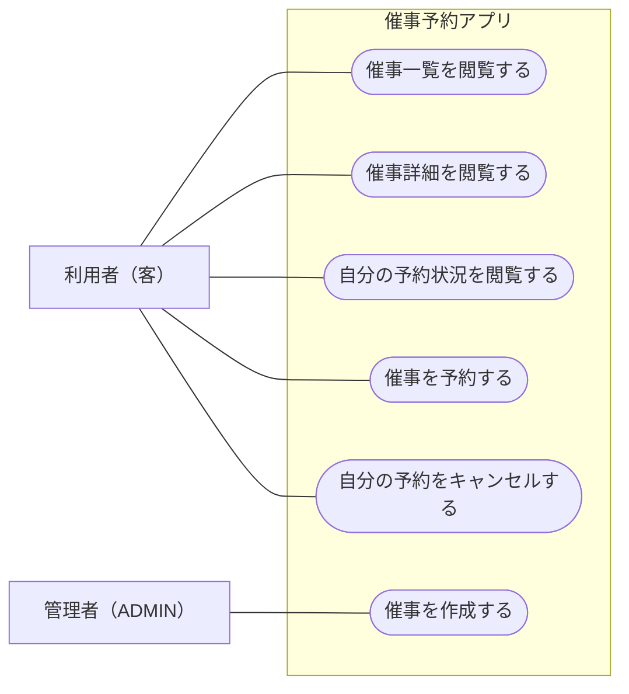

# ユースケース図

ユースケースは「催事一覧を閲覧する」「催事詳細を閲覧する」「自分の予約状況を閲覧する」「予約する」「キャンセルする」「催事を作成する」の6つです。
アクターは「利用者（客）」と「管理者」です。管理者は `ADMIN` ロールを持ち、催事を作成できます。
各操作で使う業務用語は [ユビキタス言語](./ubiquitous-language.md) を参照してください。
Mermaidのflowchartで利用者とユースケースの関係を表しています。

## 画面と操作

| 画面 | 利用者の操作 | Applicationの操作案 |
| --- | --- | --- |
| 催事一覧 | 催事を探して詳細を開く | `EventApplicationService.list`（`Event[]` を返す） |
| 催事作成（ADMIN限定） | 催事名・会場・開催日時・定員を指定して作成する | `VenueApplicationService.list` / `EventApplicationService.create`（`Event` を返す） |
| 催事詳細 | 開催情報・会場名・残席を見る | `EventApplicationService.lookup`（`EventAvailability` を返す） |
| 催事詳細 | 自分の予約状況を見る | `ReservationApplicationService.lookup`（`Reservation | null` を返す） |
| 催事詳細 | 予約する | `ReservationApplicationService.reserve` |
| 催事詳細 | 自分の予約をキャンセルする | `ReservationApplicationService.cancel` |

一覧・詳細の閲覧は未認証でも可能です。催事が存在しない場合は `null` を返します。予約・キャンセルのServer ActionではAuth.jsのSessionを確認し、認証済み利用者IDをApplication Serviceへ渡します。未ログインでは更新できません。
自分の予約状況を閲覧する操作は、催事詳細の閲覧とは別ユースケースです。認証済みの場合に `ReservationApplicationService.lookup` で指定した催事に対する本人の有効な予約を取得し、再読み込み・再訪問後も予約済み状態とキャンセルボタンを復元します。キャンセル済みの予約は取得対象に含めず、有効な予約がなければ `null` を返します。キャンセル済みの記録は保存しますが、初期版に履歴画面は設けません。
ログインはAuth.jsとKeycloakの認証フローとして扱います。Keycloakのログイン画面を利用し、専用の業務画面は追加しません。
催事作成の認可はApplication Serviceで確認します。作成画面もADMIN限定にします。

催事と会場は初期データで用意し、催事は管理者による追加も可能です。催事の編集・会場の登録・編集は含めません。
ユーザー管理、複数席の予約、キャンセル待ち、チェックインも初期モデルの対象外です。

業務ルールと予約状態は [ドメインモデル](./domain-model.md)、保存構造は [ERD](./ERD.md) を参照してください。
